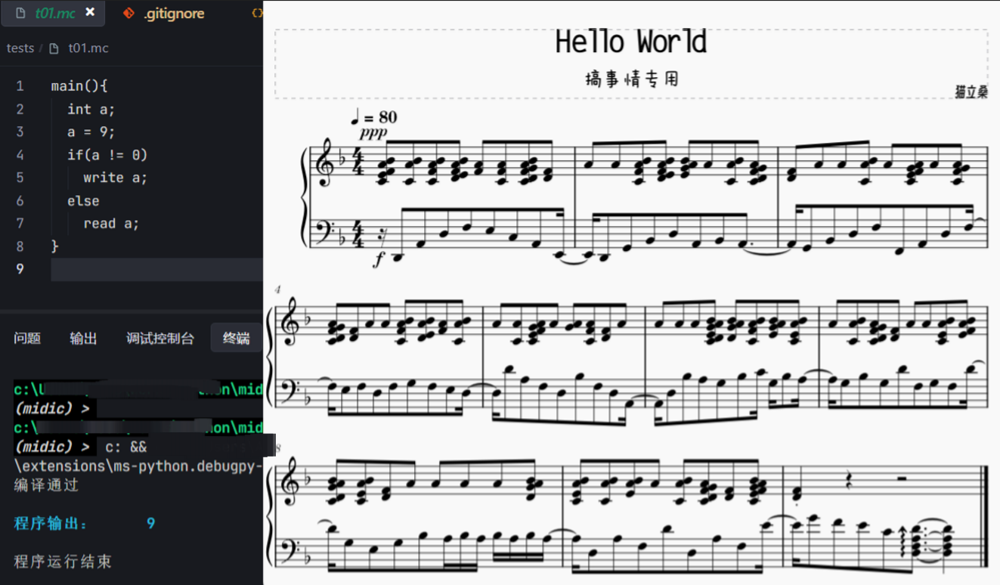
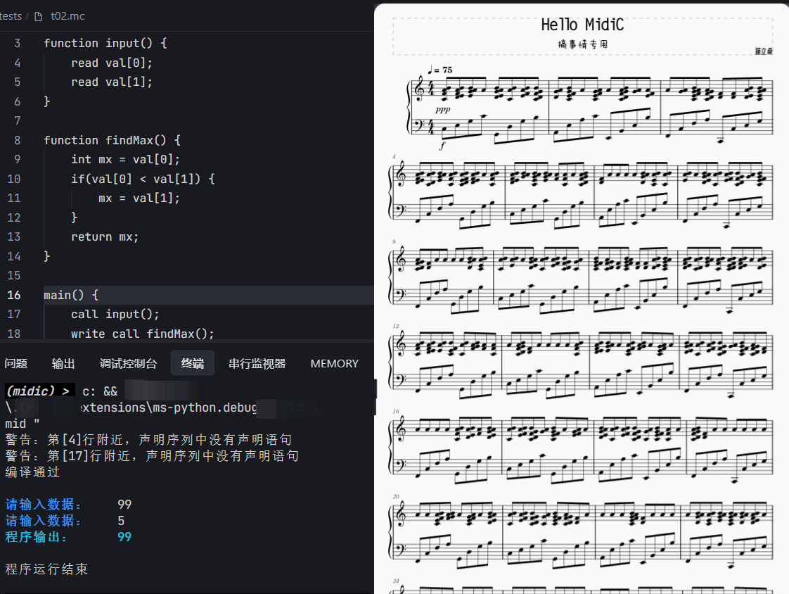

# MIDIC

这可能是世界上最没用的编程语言

它使用 MIDI 文件作为输入，解释为代码并在 python 上进行编译、执行

~~改编自2019年的编译原理大作业（玩具而已，没有卵用，不必较真）~~

## 功能演示

这个语言确实很烂，但你确实可以通过本项目将 midi 文件作为程序代码运行，虽然这并没有什么用

比如可以直接加载本项目 `tests` 目录下的 t01.mid（程序结构示例）、t02.mid（输入并输出最大值程序） 文件运行，运行方法见后面的使用方法

你可以首先完成编码，然后通过后文的转 midi 文件将代码文件转为 midi 文件，你将得到一个可以正常播放的 midi 文件，它使用C大调，但是它只有一个轨道，而且一般会比较难听，你可以添加更多轨道、调整音符时值来缓解这一问题

本程序永远顺序读取第一轨道，不关注每个音的具体时值，但如果是合起来的两个音，则会被解释为一个字符的不同比特位；此外，程序只关注以C3为起点的八个音，其余音均可自由发挥，这也是为什么示例截图中有多个轨道的原因

同时本项目还提供了 midi 文件与代码互转的功能，欢迎来玩。你可以加载自己的 midi 文件，但是它能运行的概率极低；或者使用本项目的奇怪语法进行编程，然后得到一个能运行的 midi 文件

## 使用方法

- `pip install -r requirements.txt`: 自动安装，添加 `--proxy 127.0.0.1:7890` 可以使用代理
- `pip freeze > requirements.txt`: 自动生成依赖文件

将代码转为 midi 文件：（注意，仅支持 ASCII 单字节字符，可以拓展多字节）

`python -m src.midi.midi_writer tests/t01.mc tests/t01.mid`

运行 Midi 源码：

`python -m src.main tests/t01.mid`

## 原理

### midi 文件作为文本读取

本项目只读取 midi 文件第一个 track 内，各调音阶中 C3~C4 范围内的调内音，共 8 个音，比如 C 大调读取 C3, D3, E3, F3, G3, A3, B3, C4

基于这个原理，可以很容易扩展到 16 位甚至 32 位

读取的 8 个音将作为一个字节的 8 个位，映射回 ASCII 字符，实现将整个 midi 文件作为文本文件读取

也就是说，本项目完成的只是一种基于 midi 协议的文本编码

### 编译原理

在文本流的基础上，使用编译原理方法，进行词法解析、语法分析、语义分析等，生成虚拟机字节码，最后解释执行字节码

其中各个过程相互独立，有独立的中间文件，如有错误可以在控制台报告错误具体位置（精确到行）

生成的多个过程文件在 out 目录下，方便分析过程、排查问题

## 语法

类似 C 语言的语法，支持常规分支、循环结构；有限支持函数（包括递归）、数组

暂不支持字符处理，不支持变量作为数组索引等

反正也不会有人真用这个东西编程吧，很多东西都不支持；万一真有“高手”，那还是直接看代码吧

- `core/lexical`: 词法分析程序
- `core/grammar`: 语法分析程序
- `core/semantic`: 语义分析程序
- `core/machine`: 虚拟机程序
- `core/signary`: 作用域管理
- `core/grammar_tree`: 语法树，辅助工具